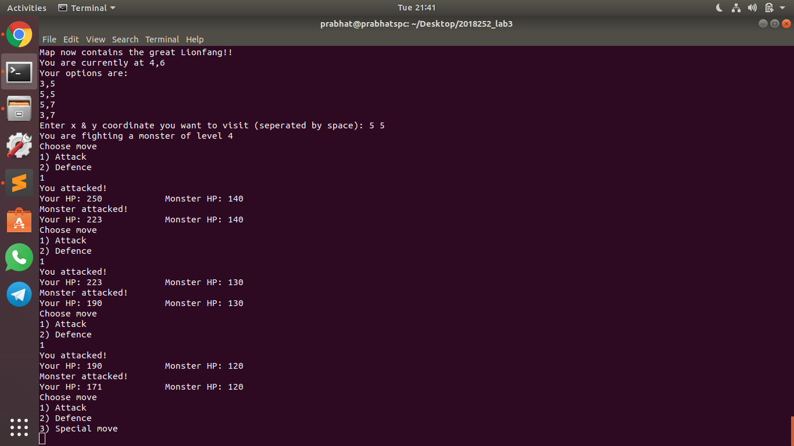
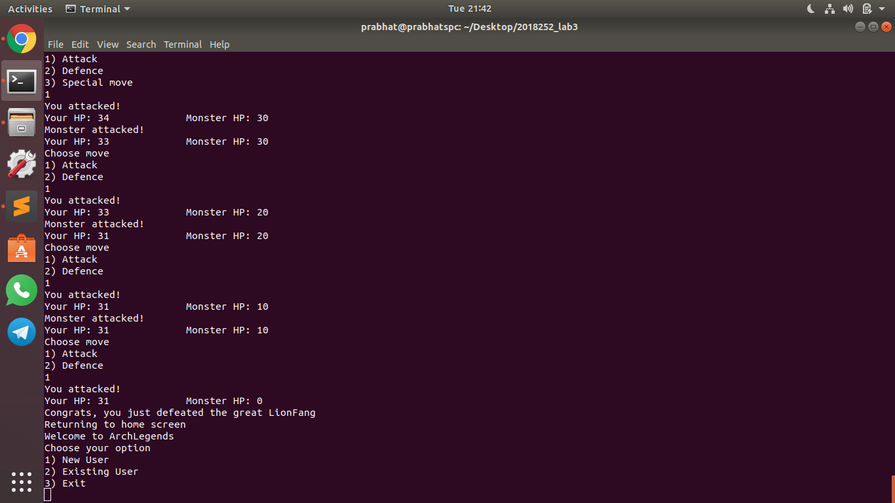

# ArchLegends
A terminal-based hero-monster fighting game, that heavily uses OOP concepts. Please read `Question.pdf` for more info on the game as it's a little detailed. This was an assignment in Advanced Programming course.


# Usage
You must have JDK installed (any version >= 8.0).
```
cd src
javac *.java # to compile the programs into .class files
java Application
```

# Images

